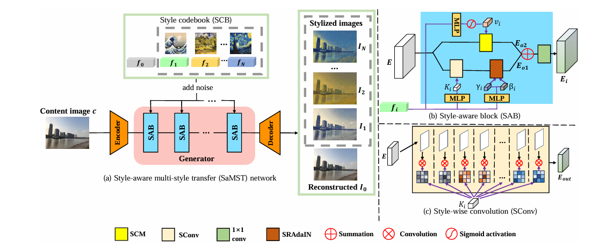
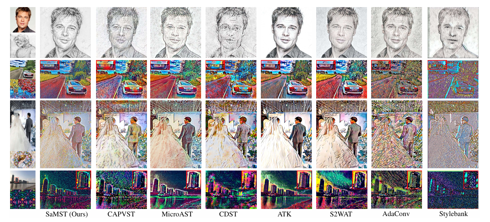

# [ACCV 2024] Pluggable Style Representation Learning for Multi-Style Transfer

Pytorch implementation of our ACCV 2024 paper ***Pluggable Style Representation Learning for Multi-Style Transfer*** [[paper](https://openaccess.thecvf.com/content/ACCV2024/papers/Liu_Pluggable_Style_Representation_Learning_for_Multi-Style_Transfer_ACCV_2024_paper.pdf)].


## :newspaper:Introduction

**TL;DR:** We introduce a novel style representation learning scheme for multi-style transfer, which achieves superior inference speed and high generation quality.

Due to the high diversity of image styles, the scalability to various styles plays a critical role in real-world applications. To accommodate a large amount of styles, previous multi-style transfer approaches rely on enlarging the model size while arbitrary-style transfer methods utilize heavy backbones. However, the additional computational cost introduced by more model parameters hinders these methods to be deployed on resource-limited devices. To address this challenge, in this paper, we develop a style transfer framework by decoupling the style modeling and transferring. Specifically, for style modeling, we propose a style representation learning scheme to encode the style information into a compact representation. Then, for style transferring, we develop a style-aware multi-style transfer network (SaMST) to adapt to diverse styles using pluggable style representations. In this way, our framework is able to accommodate diverse image styles in the learned style representations without introducing additional overhead during inference, thereby maintaining efficiency. Experiments show that our style representation can extract accurate style information. Moreover, qualitative and quantitative results demonstrate that our method achieves state-of-the-art performance in terms of both accuracy and efficiency.



*An overview of our multi-style transfer framework.*



*Visual examples*

## :wrench:Installation

- Install python 3.8.0, torch 2.0.0, CUDA 11.7 and other essential packages (Note that using other versions of packages may affect performance).
- Clone this repo

```
git clone https://github.com/Chernobyllight/SaMST
cd SaMST
```

## :red_car:Test

We provide pretrained models trained on 10 styles in ***'./checkpoints/'***. The test content images are provided in ***'./content'***.

- Get into evaluation codes folder ***'./test_model/test/'***:

  ```
  cd ./test_model/test/
  ```

- Specify the number of styles to train the whole model. 

  ```
  style_num: 10
  ```

- Run 'test.py'

  ```
  python test.py
  ```

The stylized results are listed in  ***./outputs/***.

## :bullettrain_side:Train

### :bank:Dataset Preparation

We select styles from [wikiart](https://www.kaggle.com/competitions/painter-by-numbers/data) and [pixabay](https://pixabay.com/), and use  [MS_COCO](https://cocodataset.org/#download) as our content dataset. Furthermore, the training dataset folder is ***'./train_dataset'***, and folder structure should be like:

```
train_dataset
├── style
│   ├── 000001.jpg
│   ├── 000002.jpg
│   ├── 000003.jpg
│   ├── ...
├── content
│   ├── MS_COCO
│   │   ├── 000001.jpg
│   │   ├── 000002.jpg
│   │   ├── 000003.jpg
│   │   ├── ...
```

### :running:Training


We provide two training pipelines. If you have a large number of styles, please get into ***train1***. In contrast, if you just train the model on several styles, you can get into ***train2*** to strike a fast convergence. There is no difference on the two training pipelines' option setting. Here is a example of pipeline ***train1***.

- Get into training codes folder ***'./train_model/train1/'***:

  ```
  cd ./train_model/train1/
  ```

- Run 'train.py'

  ```
  python train.py
  ```


## :star:Citation

If you find our work useful in your research, please cite our [paper](https://openaccess.thecvf.com/content/ACCV2024/papers/Liu_Pluggable_Style_Representation_Learning_for_Multi-Style_Transfer_ACCV_2024_paper.pdf)~ Thank you!

```
@inproceedings{liu2024pluggable,
  title={Pluggable Style Representation Learning for Multi-style Transfer},
  author={Liu, Hongda and Wang, Longguang and Guan, Weijun and Zhang, Ye and Guo, Yulan},
  booktitle={Proceedings of the Asian Conference on Computer Vision},
  pages={2087--2104},
  year={2024}
}
```

## :yum:Acknowledgement

This repository is heavily built upon the amazing works [Stylebank](https://github.com/jxcodetw/stylebank) and [CIN](https://github.com/kewellcjj/pytorch-multiple-style-transfer). Thanks for their great effort to community.

## :e-mail:Contact

[Hongda Liu](mailto:2946428816@qq.com)